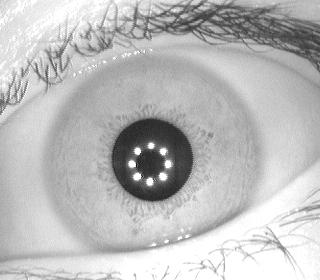
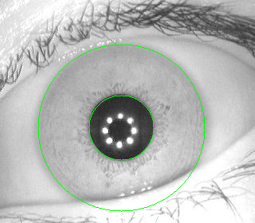
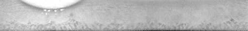

# Iris Recognition
Simple iris recognition system, implemented with Python and OpenCV.

## Introduction
This project intends to identify humans by their iris using techniques of image processing. Given the image of the eye, return the identity of that person.

## Approach
Algotihm is split into 4 main parts: iris detection, normalization, encoding and matching.

### Dataset
Used dataset comes from http://www.idealtest.org/#/datasetDetail/4. The one used for experiments comes from **CASIA-Iris-Interval** subset. Images were captured in near infrared illumination, using special close-up iris camera. It consists samples from **249 subjects**, from both left and right eye. In total there are 2639 images in 320x280 resolution.

Example image:

### Iris Detection
The first step of the algorithm is to find enclosing circle around pupil. This is done in the followin way:
 1. Apply Gaussian blur to the entire image.
 1. Compute average pixel brightness and use it to calculate threshold for image binaryzation.
 1. Apply [morphological opening](https://en.wikipedia.org/wiki/Opening_(morphology)) operation to remove remaining eyelashes and eyebrows.
 1. At this stage hopefully only pupil should be remaing, to make sure that is the case we remove all connected components besides the largest one.
 1. Find enclosing circle around remaining component.

The second step is to find iris enclosing circle. To make it easier, we can use already detected pupil.
 1. Use pupil *(X, Y)* coordinates as center for iris circle. 
 1. Use *pupil radius * 2* as baseline iris radius.
 1. Compute average pixel brightness on baseline circle and use it to set threshold for finding final radius.
 1. Keep expanding radius up to the point when average pixel brigtness will be larger than set threshold. (It should happen when we hit sclera - white part of the eye, just outside iris)
 1. In case we went over image borders, adjust radius to fit inside.

Detected circles around iris and pupil:

### Iris Normalization
To make comparison of different eye images possible extracted iris needs to be normalized. Here it is done by "unrolling" iris to 512x64 rectangle.  

1. Crop square in which iris circle is inscribed.
1. Use polar coordinates to transform iris with pupil to rectangle.
1. Based on ratio between pupil and iris radius crop rectangle to remove part covering pupil, so that only iris pixels are remaining.

Normalized iris (512x64):

### Iris Encoding
After normalizing iris next step is to transform it to binary to make comaprison easier and faster, as well as reduce memory needed to store it.

1. Normalize image.
1. Split image into 16x16 blocks.
1. Create filter using Gabor wavelets and apply it on each of the blocks.
1. Sum values in each block, independently for real and imaginary parts.
1. Set code value to 1 where sum is positive and to 0 otherwise.
1. Concatenate real and imaginary codes to form final encoding.

Encoded iris (32x8):

### Iris Matching
Iris images are matched based on similarity of encodings. It is measured by normalized Hamming distance. It is possible to add rotations into comparison and take minimal Hamming distance from successive shifts, to correct for misalignments in the normalised iris pattern caused by rotational differences during imaging.

## Results
Performance is measured by accuracy of recognizing original subject with previously unseen iris image.

1. Images for left and right eye are tested separately, both sets contain ~200 subjects. (Not all subjects have images for both left and right eye)
1. First image from each subject goes to train set and remaining ones into test set.
1. Train set is used to create a bank of templates (encodings). To each person (subject) there is a single encoding assigned. 
1. Measure similarity of each image from the test set to all templates from the bank.
1. If template with the highest similarity is a template originating from the same subject, recognition is positive, otherwise it is negative.

After performing such experiments this implementation achives **accuracy** of **65%** for left eye and **63%** for the right eye, compared to ~0.5% accuracy expected from random selection on such dataset.

## Possible Enhancements
1. Use a bank of Gabor filters, with different parameters, instead of a single one.
1. Improve on iris detection part, eg. experiment with Hough transform.
1. Experiment with different variations and sizes of Gabor filters.